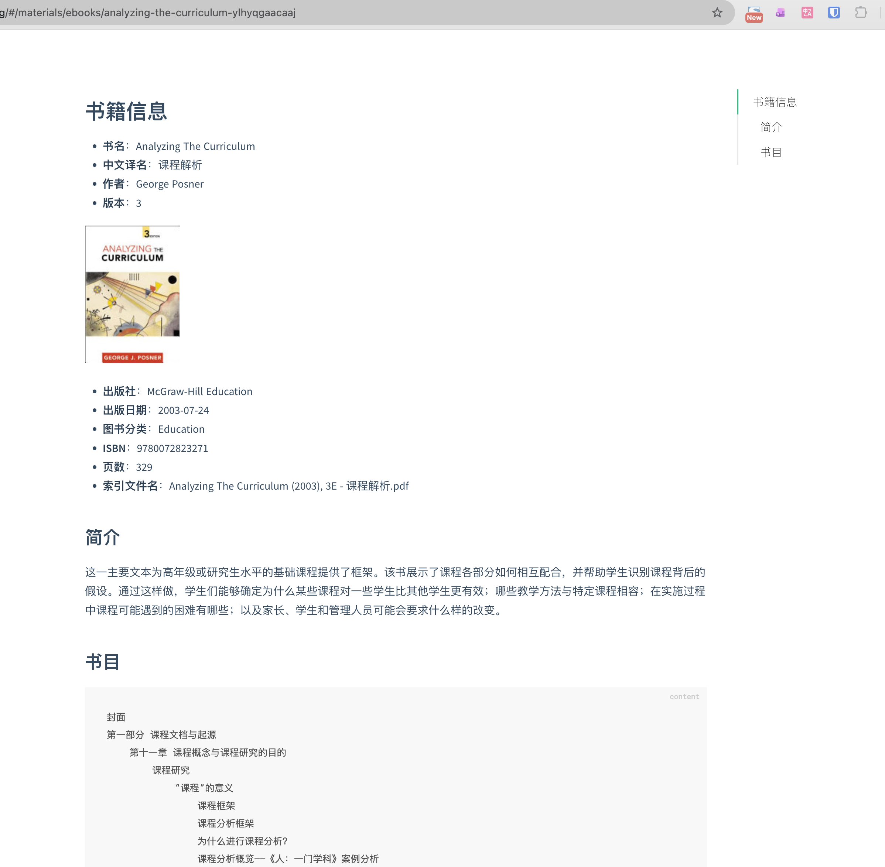
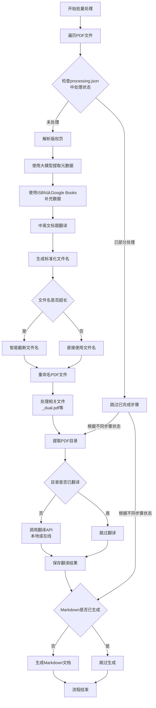

# pdfplumber PDF处理工具

处理PDF书籍文档，规范重命名、翻译目录并生成 Markdown 文件（可用于个人和AI解读书籍的信息的添加及展示）

适用于：
1、英文pdf -> 中文，快速对繁多的pdf文件信息获取，用于筛选从网上下载的pdf文件，选择有用的书籍进行阅读；
2、沉浸式翻译完成后的中文pdf写入中文书签目录；

## 功能特点

- **PDF元数据提取**：自动从PDF文件的版权页提取书籍元数据（标题、作者、ISBN等）
- **智能文件重命名**：根据提取的元数据自动重命名PDF文件
- **目录翻译**：支持中英文目录翻译，可使用本地大模型或在线API，将翻译目录写入沉浸式翻译 [PDFMathTranslate-next](https://github.com/awwaawwa/PDFMathTranslate) 制作成的pdf文件中
- **Markdown生成**：自动生成书籍信息的Markdown文档
- **批量处理**：支持批量处理大量PDF文件
- **状态跟踪**：使用processing.json文件跟踪每个文件的处理状态，避免重复处理

## 项目结构

```
pdfplumber/
├── batch.py                  # 主批处理脚本
├── batch_01_cip_parser.py    # 版权页解析和元数据提取
├── batch_02_rename.py        # 文件重命名
├── batch_03_toc.py           # 目录翻译处理
├── batch_04_md.py            # Markdown文档生成
├── _utils.py                 # 工具函数库
├── config.json               # 配置文件
├── processing.json           # 处理状态记录文件
├── requirements.txt          # 依赖包列表
└── processing/               # 处理过程中生成的临时文件
```

## 项目截图




## 核心处理流程



## 详细模块说明

### 1. 元数据提取 (batch_01_cip_parser.py)

该模块负责从PDF文件中提取元数据：

1. **版权页定位**：
   - 搜索PDF前10页寻找版权信息
   - 使用文本匹配和OCR技术识别版权页
   - 匹配关键词包括"Copyright"、"©"、"ISBN"等

2. **元数据解析**：
   - 使用本地大模型(Ollama)解析版权页信息
   - 通过ISBN从Google Books API获取补充数据
   - 合并多个数据源信息，优先使用Google Books数据

3. **标题翻译**：
   - 英文标题翻译为中文
   - 支持DeepSeek API和本地大模型两种翻译方式

### 2. 文件重命名 (batch_02_rename.py)

该模块负责根据元数据重命名文件：

1. **文件名生成**：
   - 格式：`[英文标题] ([年份])[, [版本]E] - [中文标题].pdf`
   - 自动处理文件名超长问题，智能截断

2. **关联文件处理**：
   - 同时重命名相关文件（如`_dual.pdf`、`_translated.pdf`等）

### 3. 目录翻译 (batch_03_toc.py)

该模块负责PDF目录的翻译处理：

1. **目录提取**：
   - 从PDF文件中提取书签/目录结构

2. **目录翻译**：
   - 支持Part/Chapter/Appendix等结构的专业翻译
   - 保持目录层级结构不变

3. **结果保存**：
   - 翻译结果保存为XML格式

### 4. Markdown生成 (batch_04_md.py)

该模块负责生成书籍信息的Markdown文档：

1. **文档结构**：
   - 书籍基本信息（标题、作者、出版社等）
   - 封面图片
   - ISBN和分类信息
   - 简介内容
   - 目录结构

2. **封面处理**：
   - 自动下载书籍封面图片
   - 保存到covers目录

## 配置文件说明

### 配置说明

配置文件采用JSON格式，支持多环境配置。程序会根据以下优先级选择配置：
1. 环境变量APP_ENV指定的配置
2. 与主机名完全匹配的配置
3. default配置

主要配置项包括：
- **WIKI_BASE_PATH**: wiki基础路径，用于存放处理后的文件
- **EOOKS_PATH**: 电子书原始文件路径
- **LOG_LEVEL**: 日志级别
- **OLLAMA_BASE_URL**: Ollama服务地址
- **OLLAMA_MODEL**: 使用的Ollama模型
- **DEEPSEEK_API_KEY**: DeepSeek API密钥（如果使用DeepSeek）
- **PROXIES**: 代理设置


### config.json

支持多环境配置，可以根据主机名或环境变量选择不同的配置：

```json
{
    "default": {
        "WIKI_BASE_PATH": "/path/to/your/wiki/base/path",
        "EOOKS_PATH": "/path/to/your/ebooks/path",
        "LOG_LEVEL": "INFO",
        "OLLAMA_BASE_URL": "http://localhost:11434",
        "OLLAMA_MODEL": "qwen2.5:14b-instruct-q4_K_M",
        "DEEPSEEK_API_KEY": "your_deepseek_api_key_here",
        "PROXIES": {
            "http": "",
            "https": ""
        }
    },
    "$HOSTNAME": {
        "hostname": "$HOSTNAME",
        "WIKI_BASE_PATH": "/path/to/your/wiki/base/path",
        "EOOKS_PATH": "/path/to/your/ebooks/path",
        "LOG_LEVEL": "INFO",
        "OLLAMA_BASE_URL": "http://localhost:11434",
        "OLLAMA_MODEL": "qwen2.5:14b-instruct-q4_K_M",
        "DEEPSEEK_API_KEY": "your_deepseek_api_key_here",
        "PROXIES": {
            "http": "",
            "https": ""
        }
    }
}
```

## 状态管理

使用`processing.json`文件跟踪每个文件的处理状态，避免重复处理：

```json
{
  "status": {
    "rename_done": true,
    "parse_metadata": true,
    "trans_toc": true,
    "build_md": true
  },
  "books_id": "NLJR-xxxxxxxxxxxx",
  "norm_isbn": "9789351342939",
  "standard_name": "Original Filename.pdf",
  "safe_title": "generated-title-with-id",
  "meta_json": "metadata-file.json",
  "md_file": "markdown-file.md"
}
```

## 使用方法

1. 确保安装所需依赖：
   ```bash
   pip install -r requirements.txt
   ```

2. 配置环境：
   - 配置`config.json`文件
   - 确保Ollama服务运行正常
   - 如使用DeepSeek API，配置相应的API密钥

3. 运行批处理脚本：
   ```bash
   python batch.py
   ```

## 技术栈

- **Python**：主要编程语言
- **PyMuPDF (fitz)**：PDF处理库
- **RapidOCR**：光学字符识别
- **Ollama**：本地大模型服务
- **Requests**：HTTP请求库
- **JSON**：数据存储格式

## 注意事项

1. 文件名长度限制：系统会自动处理超过255字符的文件名
2. 网络依赖：部分功能需要访问Google Books API和DeepSeek API
3. 大模型依赖：需要本地运行Ollama服务
4. 状态跟踪：processing.json文件非常重要，请勿随意删除